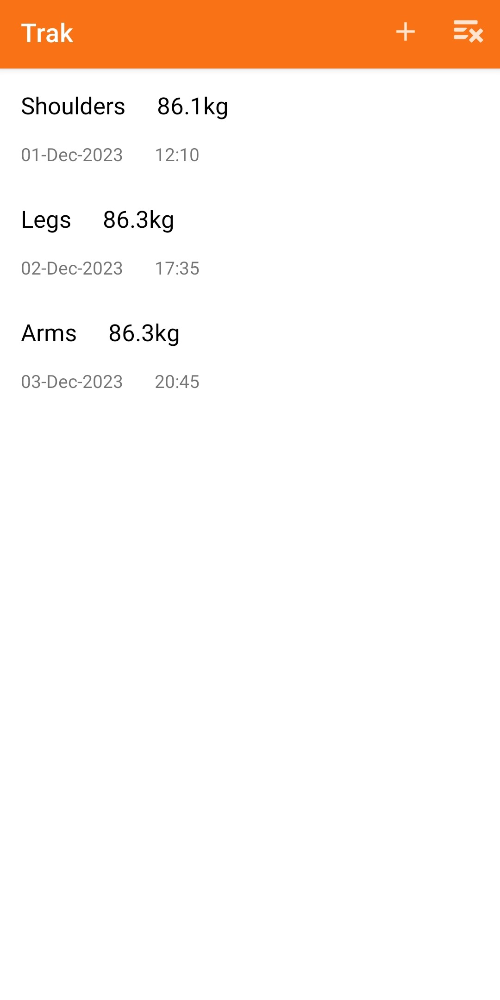

# Trak



Progress tracker for CSC2074 Mobile Application Development.

[Source Repository](https://github.com/ChiefWoods/Trak)

## Features

- Track your workouts
- Create daily entries
- Snap photos of your progress

## Built With

### Languages

- [](https://kotlinlang.org/)

### Tools

- [](https://developer.android.com/studio)

## Getting Started

### Setup

1. Clone the repository
```
git clone https://github.com/ChiefWoods/Trak.git
```

## Issues

View the [open issues](https://github.com/ChiefWoods/Trak/issues) for a full list of proposed features and known bugs.

## Acknowledgements

### Resources

- [Shields.io](https://shields.io/)

## Contact

[chii.yuen@hotmail.com](mailto:chii.yuen@hotmail.com)